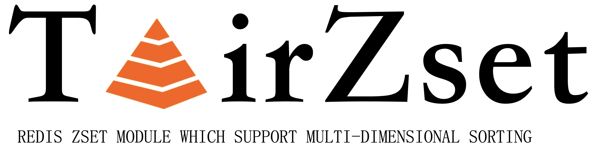

[](https://github.com/alibaba/TairZset/actions/workflows/cmake.yml)
[](https://github.com/alibaba/TairZset/actions/workflows/ci.yml)
[](https://github.com/alibaba/TairZset/actions/workflows/docker-image.yml)


<div align=center>

</div>
   

## 简介  [英文说明](README.md)
     TairZset是基于redis module开发的一种数据结构，和redis原生的zset数据结构相比，TairZset不但和原生zset一样具有丰富的数据接口和高性能，还提供了（任意）多维排序的能力。

### 主要的特性如下：

- 支持多维(最大255)score排序，且任意维度精度不丢失
- 在多维score下仍然支持incrby语义
- 语法和原生zset类似

### 排序规则：      
对于多维score而言，左边的score优先级大于右边的score，以一个三维score为例：score1#score2#score3，tairzset在比较时，会先比较score1，只有score1相等时才会比较score2，否则就以score1的比较结果作为整个score的比较结果。同理，只有当score2相等时才会比较score3。   
   
### 应用场景：
- 游戏玩家之间排序
- 直播间主播热度排序

## 快速开始
```
127.0.0.1:6379> exzadd tairzsetkey 1.1 x 2.2 y
(integer) 2
127.0.0.1:6379> exzrange tairzsetkey 0 -1 withscores
1) "x"
2) "1.1000000000000001"
3) "y"
4) "2.2000000000000002"
127.0.0.1:6379> exzincrby tairzsetkey 2 x 
"3.1000000000000001"
127.0.0.1:6379> exzrange tairzsetkey 0 -1 withscores
1) "y"
2) "2.2000000000000002"
3) "x"
4) "3.1000000000000001"
127.0.0.1:6379> exzadd tairzsetkey 3.3#3.3 z
(error) ERR score is not a valid format
127.0.0.1:6379> del tairzsetkey
(integer) 1
127.0.0.1:6379> exzadd tairzsetkey 1.1#3.3 x 2.2#2.2 y 3.3#1.1 z
(integer) 3
127.0.0.1:6379> exzrange tairzsetkey 0 -1 withscores
1) "x"
2) "1.1000000000000001#3.2999999999999998"
3) "y"
4) "2.2000000000000002#2.2000000000000002"
5) "z"
6) "3.2999999999999998#1.1000000000000001"
127.0.0.1:6379> exzincrby tairzsetkey 2 y 
(error) ERR score is not a valid format
127.0.0.1:6379> exzincrby tairzsetkey 2#0 y 
"4.2000000000000002#2.2000000000000002"
127.0.0.1:6379> exzrange tairzsetkey 0 -1 withscores
1) "x"
2) "1.1000000000000001#3.2999999999999998"
3) "z"
4) "3.2999999999999998#1.1000000000000001"
5) "y"
6) "4.2000000000000002#2.2000000000000002"
```

## Docker
```
docker run -p 6379:6379 tairmodule/tairzset:latest
```

## 编译及使用

```
mkdir build  
cd build  
cmake ../ && make -j
```
编译成功后会在lib目录下产生tairzset_module.so库文件

```
./redis-server --loadmodule /path/to/tairzset_module.so
```
## 测试方法

1. 修改`tests`目录下tairzset.tcl文件中的路径为`set testmodule [file your_path/tairzset_module.so]`
2. 将`tests`目录下tairzset.tcl文件路径加入到redis的test_helper.tcl的all_tests中
3. 在redis根目录下运行./runtest --single tairzset

## 客户端

| language | GitHub |
|----------|---|
| Java     |https://github.com/alibaba/alibabacloud-tairjedis-sdk|
| Python   |https://github.com/alibaba/tair-py|
| Go       |https://github.com/alibaba/tair-go|
| .Net     |https://github.com/alibaba/AlibabaCloud.TairSDK|

## API
[参考这里](CMDDOC.md)

## 适用redis版本
redis 5.x 、redis 6.x

## 我们的modules

[TairHash](https://github.com/alibaba/TairHash): 和redis hash类似，但是可以为field设置expire和version，支持高效的主动过期和被动过期   
[TairZset](https://github.com/alibaba/TairZset): 和redis zset类似，但是支持多（最大255）维排序，同时支持incrby语义，非常适合游戏排行榜场景   
[TairString](https://github.com/alibaba/TairString): 和redis string类似，但是支持设置expire和version，并提供CAS/CAD等实用命令，非常适用于分布式锁等场景  

